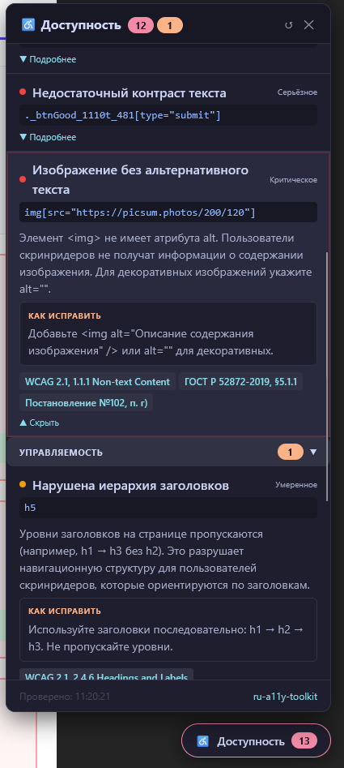

# ru-a11y-toolkit-overlay

[](https://www.npmjs.com/package/ru-a11y-toolkit-overlay)
[](../../LICENSE)

**Runtime-визуализатор нарушений доступности для React-приложений**

Часть экосистемы [ru-a11y-toolkit](https://www.npmjs.com/package/ru-a11y-toolkit) — набора инструментов для проверки веб-доступности по российским нормативам:

- **ГОСТ Р 52872-2019** «Интернет-ресурсы и другая информация, представленная в электронно-цифровой форме»
- **Постановление Правительства РФ №102** от 07.02.2026
- **WCAG 2.1/2.2** (Web Content Accessibility Guidelines)

---

## Что делает этот пакет

`ru-a11y-toolkit-overlay` — это React-компонент, который в **dev-режиме** добавляет поверх вашего приложения панель с отчётом о нарушениях доступности, найденных с помощью [axe-core](https://github.com/dequelabs/axe-core).

**Overlay не заменяет** [`ru-a11y-toolkit-eslint`](https://www.npmjs.com/package/ru-a11y-toolkit-eslint) и CLI-сканер — он **дополняет** их, давая визуальную обратную связь прямо в браузере в процессе разработки.

```

```

### Возможности

- 🔍 **Автоматическое сканирование** через axe-core при загрузке и при изменениях DOM (MutationObserver)
- 🎨 **Визуальная подсветка** проблемных элементов прямо на странице
- 🇷🇺 **Русскоязычные описания** — что нарушено, почему это проблема, как исправить
- 📋 **Нормативные ссылки** — ГОСТ Р 52872-2019, Постановление №102, WCAG 2.1
- 📊 **Группировка по принципам WCAG**: Воспринимаемость / Управляемость / Понятность / Надёжность
- 🖱️ **Перетаскиваемая панель** — не мешает работе с приложением
- ⚡ **Только dev-режим** — никакого влияния на production-бандл

---

## Установка

```bash
npm install --save-dev ru-a11y-toolkit-overlay
```

или

```bash
yarn add -D ru-a11y-toolkit-overlay
```

**Peer dependencies** (должны быть установлены в вашем проекте):

```bash
npm install react react-dom
```

---

## Быстрый старт

### Vite / Create React App

```tsx
// src/main.tsx или src/index.tsx
import React from 'react';
import ReactDOM from 'react-dom/client';
import App from './App';

// Ленивый импорт, чтобы не попасть в production-бандл
const RuA11yOverlay = import.meta.env.DEV
  ? (await import('ru-a11y-toolkit-overlay')).RuA11yOverlay
  : null;

const root = ReactDOM.createRoot(document.getElementById('root')!);

root.render(
  <React.StrictMode>
    <App />
    {import.meta.env.DEV && RuA11yOverlay && <RuA11yOverlay />}
  </React.StrictMode>,
);
```

### Простой способ (через process.env)

```tsx
// src/main.tsx
import React from 'react';
import ReactDOM from 'react-dom/client';
import App from './App';
import { RuA11yOverlay } from 'ru-a11y-toolkit-overlay';

const root = ReactDOM.createRoot(document.getElementById('root')!);

root.render(
  <React.StrictMode>
    <App />
    {process.env.NODE_ENV === 'development' && <RuA11yOverlay />}
  </React.StrictMode>,
);
```

> **Примечание:** При использовании Vite tree-shaking автоматически уберёт overlay из production-сборки, если вы используете `import.meta.env.DEV`. При использовании `process.env.NODE_ENV` убедитесь, что ваш бандлер правильно заменяет это значение.

---

## API

### `<RuA11yOverlay />` — пропсы

| Prop              | Тип                                      | По умолчанию    | Описание                                                                                |
| ----------------- | ---------------------------------------- | --------------- | --------------------------------------------------------------------------------------- |
| `preset`          | `'recommended' \| 'gost-aa' \| 'strict'` | `'recommended'` | Набор правил проверки (см. ниже)                                                        |
| `excludeSelector` | `string`                                 | —               | CSS-селектор элементов, исключаемых из сканирования (оверлей исключается автоматически) |
| `debounceMs`      | `number`                                 | `1000`          | Задержка ресканирования при изменениях DOM (мс)                                         |
| `autoScan`        | `boolean`                                | `true`          | Автоматически пересканировать при изменениях DOM                                        |
| `customRules`     | `boolean`                                | `true`          | Запускать дополнительные DOM-проверки ru-a11y поверх axe-core                          |
| `axeRules`        | `boolean`                                | `true`          | Запускать стандартные проверки axe-core; можно отключить для custom-only демо          |

#### Пресеты (`preset`)

| Пресет        | Уровень                     | Для кого                                                  |
| ------------- | --------------------------- | --------------------------------------------------------- |
| `recommended` | WCAG 2.1 AA                 | Все проекты — базовые критические проверки                |
| `gost-aa`     | WCAG 2.1 AA + best-practice | Гос. органы, порталы под Постановление №102               |
| `strict`      | WCAG 2.1 AAA                | Максимальная строгость, включая экспериментальные правила |

### Пример с настройками

```tsx
<RuA11yOverlay preset="gost-aa" debounceMs={2000} autoScan={false} />
```

---

## Расширенное использование

### Доступ к маппингу правил

```ts
import { getRuleMeta, RU_A11Y_RULES, WCAG_PRINCIPLES } from 'ru-a11y-toolkit-overlay';

// Получить метаданные правила по ID axe-core
const meta = getRuleMeta('image-alt');
console.log(meta.title); // 'Изображение без альтернативного текста'
console.log(meta.gost); // 'ГОСТ Р 52872-2019, §5.1.1'
console.log(meta.post102); // 'Постановление №102, п. г)'
console.log(meta.wcag); // 'WCAG 2.1, 1.1.1 Non-text Content'
console.log(meta.severity); // 'error'

// Получить все правила
console.log(Object.keys(RU_A11Y_RULES)); // ['image-alt', 'color-contrast', ...]

// Принципы WCAG на русском
console.log(WCAG_PRINCIPLES);
// { perceivable: 'Воспринимаемость', operable: 'Управляемость', ... }
```

---

## Связь с ru-a11y-toolkit-core

Overlay получает **единый маппинг правил** из `ru-a11y-toolkit-core`, как CLI и ESLint-пакет. Идентификаторы нарушений согласованы:

| Инструмент                | Когда работает                     | Что проверяет                             |
| ------------------------- | ---------------------------------- | ----------------------------------------- |
| `ru-a11y-toolkit-eslint`  | В IDE / CI во время написания кода | JSX-атрибуты, семантика компонентов       |
| `ru-a11y-toolkit-overlay` | В браузере во время разработки     | Реальный DOM, динамический контент, цвета |
| `ru-a11y-toolkit-cli`     | В CI/CD на готовой странице        | Полная страница, включая SEO и структуру  |

**Рекомендуемый подход** — использовать все три инструмента вместе для максимального покрытия.

---

## Дополнительные runtime-правила ru-a11y

Помимо `axe-core`, overlay запускает собственные DOM-проверки `ru-a11y`, чтобы покрыть требования ГОСТ/Постановления №102, которые в браузере можно проверить точнее, чем на уровне JSX.

Итог после расширения:

| Блок | Количество | Что изменилось |
| --- | ---: | --- |
| Новые runtime-проверки overlay | 44 | Добавлен слой `customRules`, который проверяет DOM поверх axe-core |
| Общий каталог метаданных | 115 | Overlay, CLI и ESLint используют один источник названий, описаний, рекомендаций и ссылок |
| Собственные ESLint-правила | 10 | 7 существующих + 3 новых правила для main, h1 и autoplay-медиа |

### Список runtime-проверок overlay

| Правило | Пресет | Нормативный смысл |
| --- | --- | --- |
| `bypass` | `gost-aa`, `strict` | Наличие механизма пропуска повторяющихся блоков навигации |
| `skip-link` | `gost-aa`, `strict` | Skip-link должен вести на существующий элемент |
| `html-has-lang` | все | Язык страницы должен быть программно определён |
| `html-lang-valid` | все | Значение `lang` должно быть валидным кодом языка |
| `html-xml-lang-mismatch` | `strict` | `lang` и `xml:lang` не должны конфликтовать |
| `document-title` | все | Страница должна иметь информативный `<title>` |
| `page-has-heading-one` | `gost-aa`, `strict` | На странице должен быть заголовок первого уровня |
| `heading-order` | `gost-aa`, `strict` | Уровни заголовков не должны пропускаться |
| `empty-heading` | все | Заголовки не должны быть пустыми |
| `meta-viewport` | все | Масштабирование до 200% не должно блокироваться |
| `meta-viewport-large` | `strict` | Строгий запас масштабирования до 500% |
| `no-table-layout` | `gost-aa`, `strict` | Таблицы без табличной семантики не должны использоваться как layout |
| `table-requires-th` | все | Таблица данных должна иметь заголовочные ячейки |
| `empty-table-header` | `gost-aa`, `strict` | Заголовочная ячейка таблицы не должна быть пустой |
| `scope-attr-valid` | все | `scope` допустим только на `<th>` и только с валидным значением |
| `table-fake-caption` | `strict` | Подпись таблицы должна быть `<caption>`, а не первой строкой |
| `frame-title-unique` | `gost-aa`, `strict` | Фреймы должны иметь различимые title |
| `frame-focusable-content` | `strict` | Фрейм с фокусируемым содержимым не должен исключаться из фокуса |
| `blink` | все | Запрет устаревшего мигающего контента |
| `marquee` | все | Запрет бегущей строки как недоступного движения |
| `meta-refresh` | `gost-aa`, `strict` | Автообновление/перенаправление страницы недоступно без контроля |
| `no-autoplay-audio` | `gost-aa`, `strict` | Автовоспроизведение звука должно иметь управление |
| `audio-caption` | `gost-aa`, `strict` | Аудио должно иметь текстовую альтернативу/субтитры |
| `input-button-name` | все | Кнопочные input должны иметь доступное имя |
| `input-image-alt` | все | `input[type=image]` должен иметь alt |
| `select-name` | все | Select должен иметь доступное имя |
| `label-title-only` | `strict` | Поле формы не должно размечаться только через `title` |
| `svg-img-alt` | `gost-aa`, `strict` | SVG с `role="img"` должен иметь имя |
| `role-img-alt` | `gost-aa`, `strict` | Любой `role="img"` должен иметь текстовую альтернативу |
| `object-alt` | `gost-aa`, `strict` | `<object>` должен иметь альтернативный текст |
| `nested-interactive` | все | Интерактивные элементы не должны вкладываться друг в друга |
| `focus-order-semantics` | `gost-aa`, `strict` | Фокусируемый элемент должен иметь интерактивную семантику |
| `landmark-one-main` | `gost-aa`, `strict` | Должна быть одна основная область `<main>`/`role="main"` |
| `landmark-no-duplicate-main` | `gost-aa`, `strict` | Не должно быть нескольких main-landmark |
| `landmark-unique` | `strict` | Однотипные landmark-регионы должны различаться именем |
| `duplicate-id` | все | Значения `id` должны быть уникальными |
| `duplicate-id-active` | все | Интерактивные элементы не должны дублировать `id` |
| `duplicate-id-aria` | все | `id`, на которые ссылаются ARIA/label, должны быть уникальными |
| `accesskeys` | `strict` | `accesskey` не должны дублироваться |
| `aria-hidden-body` | все | Нельзя скрывать весь `<body>` от вспомогательных технологий |
| `aria-hidden-focus` | все | Скрытый через `aria-hidden` контент не должен получать фокус |
| `presentation-role-conflict` | `gost-aa`, `strict` | `role="presentation"` не должен конфликтовать с ARIA/tabindex |
| `p-as-heading` | `strict` | Заголовки должны быть семантическими, а не стилизованными `<p>` |
| `target-size` | `strict` | Интерактивные цели должны быть достаточного размера |

### Где требования пересекаются

Некоторые проверки выглядят похожими, но закрывают разные формулировки:

| Группа | WCAG/axe | ГОСТ/№102-уточнение |
| --- | --- | --- |
| Заголовки | `heading-order`, `empty-heading` | Дополнительно фиксируем наличие H1 и понятный `<title>` как навигационные ориентиры |
| Таблицы | `table-requires-th`, `scope-attr-valid` | Отдельно различаем таблицы данных и таблицы для вёрстки |
| Навигация | `bypass` | Дополнительно проверяем, что skip-link ведёт на существующий DOM-элемент |
| Язык | `html-has-lang` | Для российских сайтов можно отдельно контролировать русский язык и конфликт `xml:lang` |
| Формы | `select-name`, `label-title-only` | ГОСТ/№102 требуют не просто наличие имени, а понятную программную связь с элементом управления |

---

## Ограничения

> ⚠️ Overlay **не заменяет** ручное тестирование с настоящим скринридером (NVDA, VoiceOver, JAWS).

- axe-core автоматически находит примерно **57% нарушений WCAG** — остальное требует ручной проверки.
- Проверка контраста цветов требует, чтобы стили были полностью загружены — результаты могут отличаться для динамически добавляемых стилей.
- Оверлей не проверяет пользовательский сценарий работы с клавиатурой — это нужно проверять вручную.

---

## Разработка

```bash
# Установка зависимостей
npm install

# Сборка
npm run build

# Сборка в watch-режиме
npm run dev

# Тесты
npm test
```

### Структура пакета

```
ru-a11y-toolkit-overlay/
  src/
    index.ts              # Точка входа, публичный API
    RuA11yOverlay.tsx     # Главный React-компонент
    axeRunner.ts          # Запуск axe-core + MutationObserver
    mapping/
      rulesMap.ts         # Маппинг ruleId → ГОСТ/№102/WCAG + русские тексты
    ui/
      Panel.tsx           # Основная панель
      ErrorList.tsx       # Список нарушений с группировкой
      ErrorItem.tsx       # Один элемент нарушения
      HighlightLayer.tsx  # Подсветка элементов на странице
      styles.ts           # Инлайн-стили (без внешних зависимостей)
  tests/
    rulesMap.test.ts      # Тесты маппинга правил
    RuA11yOverlay.test.tsx # Тесты компонента
  dist/                   # Сборка (генерируется автоматически)
  tsconfig.json
  tsup.config.ts
```

---

## Лицензия

MIT © [biondohod](https://github.com/biondohod)

---

## Ссылки

- [ru-a11y-toolkit](https://www.npmjs.com/package/ru-a11y-toolkit) — мета-пакет для всех инструментов доступности
- [ru-a11y-toolkit-eslint](https://www.npmjs.com/package/ru-a11y-toolkit-eslint) — ESLint-плагин
- [ГОСТ Р 52872-2019](https://protect.gost.ru/) — стандарт доступности
- [axe-core](https://github.com/dequelabs/axe-core) — движок проверки доступности
- [WCAG 2.1](https://www.w3.org/TR/WCAG21/) — руководство по доступности веб-контента
